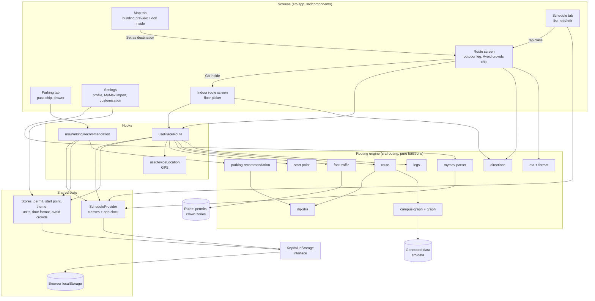

```mermaid
flowchart TB
  subgraph UI["Screens (src/app, src/components)"]
    MAP[Map tab<br/>building preview, Look inside]
    SCH[Schedule tab<br/>list, add/edit]
    PRK[Parking tab<br/>pass chip, drawer]
    SET[Settings<br/>profile, MyMav import, customization]
    RS[Route screen<br/>outdoor leg, Avoid crowds chip]
    IRS[Indoor route screen<br/>floor picker]
  end
  subgraph State["Shared state"]
    SP[ScheduleProvider<br/>classes + app clock]
    ST[Stores: permit, start point, theme,<br/>units, time format, avoid crowds]
    LS[(Browser localStorage)]
  end
  subgraph Hooks
    UPR[usePlaceRoute]
    LOC[useDeviceLocation<br/>GPS]
    PREC[useParkingRecommendation]
  end
  subgraph Engine["Routing engine (src/routing, pure functions)"]
    STA[start-point]
    GR[campus-graph + graph]
    RT[route]
    DJ[dijkstra]
    FT[foot-traffic]
    LG[legs]
    DIR[directions]
    ETA[eta + format]
    PR[parking-recommendation]
    MM[mymav-parser]
  end
  DATA[(Generated data<br/>src/data)]
  RULES[(Rules: permits,<br/>crowd zones)]

  MAP -->|Set as destination| RS
  SCH -->|tap class| RS
  RS -->|Go inside| IRS
  RS --> UPR
  IRS --> UPR
  PRK --> PREC
  SET --> MM --> SP
  SCH --> SP
  SET --> ST
  UPR --> SP
  UPR --> ST
  UPR --> LOC
  UPR --> STA
  UPR --> FT
  UPR --> RT
  UPR --> LG
  RS --> DIR
  IRS --> DIR
  RS --> ETA
  RT --> DJ
  RT --> GR
  FT --> RULES
  PREC --> SP
  PREC --> ST
  PREC --> PR --> DJ
  GR --> DATA
  ST --> KV
  SP --> KV
  KV[KeyValueStorage<br/>interface] --> LS
```